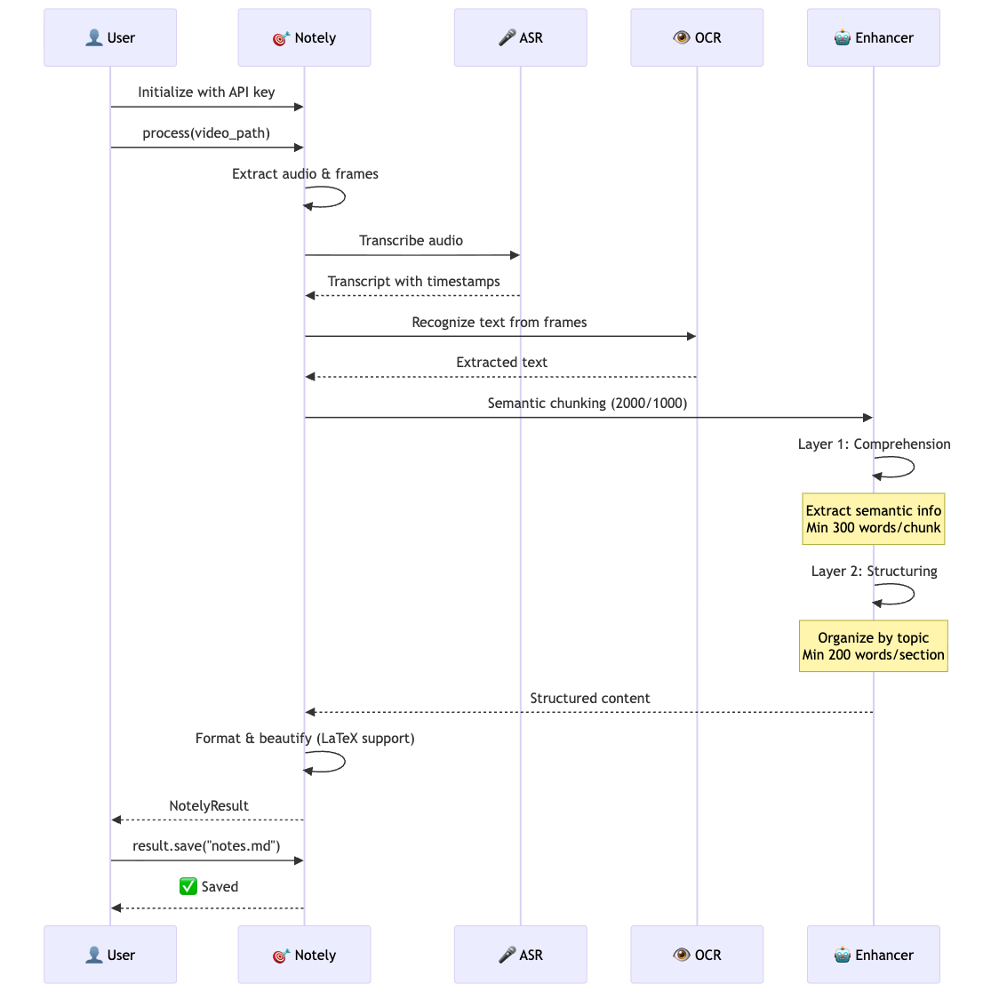
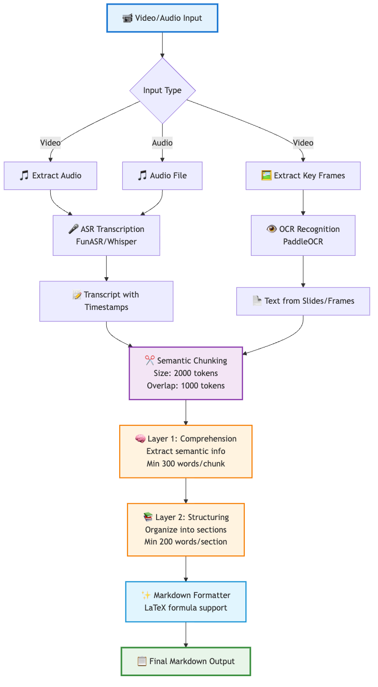
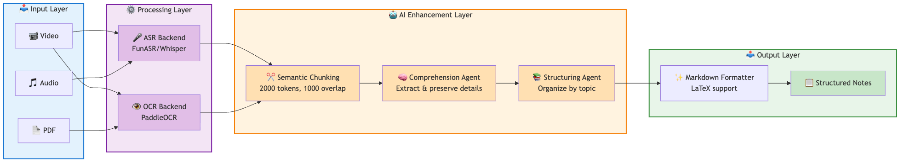

# Notely

English | [简体中文](README_zh.md)

<p align="center">
  
  
  
  
  
</p>

<p align="center">
  <em>Automatically transform video/audio lectures into structured Markdown notes</em>
</p>

---

**Notely** is a Python SDK that uses ASR, OCR, and LLM technologies to automatically convert lecture videos, audio recordings, and presentations into high-quality Markdown notes.

## Core Features

- 🎯 **High-Quality Speech Recognition** - FunASR (Chinese CER < 3%), Whisper (multilingual)
- 📊 **Intelligent OCR** - PaddleOCR + key frame deduplication
- 🤖 **Multi-LLM Support** - OpenAI, Zhipu AI, Anthropic, Moonshot, DeepSeek
- 🧠 **Three-Layer Enhancement Architecture** - Comprehension → Structuring → Polishing
- ✂️ **Semantic Chunking** - Intelligent text segmentation (2000 tokens, 1000 overlap)
- 📐 **LaTeX Formula Support** - Mathematical notation rendering
- 🌍 **Language Auto-Detection** - Automatic transcript language detection
- ⚡ **Concurrent Processing** - Parallel chunk processing for efficiency
- ✨ **Beautiful Output** - Structured Markdown with automatic formatting
- 🔧 **Flexible Configuration** - Simple initialization with deep customization support

---

## Quick Start

### 1. Installation

```bash
# Clone the repository
git clone https://github.com/0xarcher/notely.git
cd notely

# Install dependencies (recommended: uv)
curl -LsSf https://astral.sh/uv/install.sh | sh
uv sync --all-extras

# Or use pip
pip install -e ".[all]"

# Install FFmpeg (required)
# macOS
brew install ffmpeg

# Ubuntu/Debian
sudo apt-get install ffmpeg
```

### 2. Basic Usage

```python
from notely import Notely, NotelyConfig, EnhancerConfig, LLMConfig

# Method 1: From configuration object
config = NotelyConfig(
    enhancer=EnhancerConfig(
        llm=LLMConfig(
            api_key="sk-xxx",
            model="gpt-4o",
        )
    )
)
notely = Notely(config)

# Process lecture video (async)
import asyncio

result = asyncio.run(notely.process("lecture.mp4"))

# Save notes
result.save("notes.md")
```

```python
# Method 2: From dictionary (simpler)
notely = Notely.from_dict({
    "llm": {
        "api_key": "sk-xxx",
        "model": "gpt-4o",
    }
})

result = asyncio.run(notely.process("lecture.mp4"))
result.save("notes.md")
```

```python
# Method 3: From YAML file (recommended for complex configs)
# Create config.yaml first, then:
notely = Notely.from_yaml("config.yaml")
result = asyncio.run(notely.process("lecture.mp4"))
```

### 3. Usage Flow

<p align="center">
  
</p>

**Example Output:**

```markdown
# Introduction to Machine Learning

> 📌 Course Info: 45 minutes | Instructor: Prof. Zhang

## 📌 Course Overview

This lecture introduces the basic concepts of machine learning...

## 📚 Key Concepts

### What is Machine Learning

**Machine learning** is a technology that enables computers to learn from data...

### Types of Machine Learning

| Type | Characteristics | Use Cases |
|------|----------------|-----------|
| **Supervised Learning** | Labeled data | Classification, Regression |
| **Unsupervised Learning** | Unlabeled data | Clustering, Dimensionality Reduction |
| **Reinforcement Learning** | Environmental feedback | Games, Robotics |

## 💡 Key Takeaways

1. Machine learning is a core AI technology
2. Algorithm selection depends on data type and task
3. **Feature engineering** is crucial for model performance
```

---

## Detailed Usage Guide

### Initialization

#### Method 1: From Dictionary (Simplest)

```python
from notely import Notely

# Basic usage
notely = Notely.from_dict({
    "llm": {"api_key": "sk-xxx", "model": "gpt-4o"}
})

# With environment variable
import os
notely = Notely.from_dict({
    "llm": {"api_key": os.getenv("OPENAI_API_KEY"), "model": "gpt-4o"}
})
```

#### Method 2: Switch LLM Provider

```python
import os

# Use Zhipu AI
notely = Notely.from_dict({
    "llm": {
        "api_key": os.getenv("ZHIPU_API_KEY"),
        "provider": "zhipu",
        "model": "glm-4",
    }
})

# Use Anthropic
notely = Notely.from_dict({
    "llm": {
        "api_key": os.getenv("ANTHROPIC_API_KEY"),
        "provider": "anthropic",
        "model": "claude-3-opus-20240229",
    }
})

# Use Moonshot
notely = Notely.from_dict({
    "llm": {
        "api_key": os.getenv("MOONSHOT_API_KEY"),
        "provider": "moonshot",
        "model": "moonshot-v1-8k",
    }
})
```

#### Method 3: Custom OpenAI-Compatible Endpoint

```python
notely = Notely.from_dict({
    "llm": {
        "api_key": "sk-xxx",
        "provider": "openai",
        "model": "qwen-plus",
        "base_url": "https://dashscope.aliyuncs.com/compatible-mode/v1",
    }
})
```

#### Method 4: Full Configuration

```python
import os

notely = Notely.from_dict({
    # LLM configuration
    "llm": {
        "api_key": os.getenv("OPENAI_API_KEY"),
        "provider": "openai",
        "model": "gpt-4o",
        "base_url": "https://api.openai.com/v1",  # Optional
        "temperature": 0.3,  # Lower for consistency (default: 0.3)
        "max_tokens": 4096,
    },

    # ASR configuration
    "asr": {
        "backend": "funasr",  # Recommended for Chinese: funasr, multilingual: whisper
        "device": "cuda",     # Use cuda with GPU, otherwise cpu
        "model": "iic/speech_paraformer-large_asr_nat-zh-cn-16k-common-vocab8404-pytorch",
        "language": "zh",
    },

    # OCR configuration
    "ocr": {
        "backend": "paddleocr",
        "language": "ch",  # Chinese: ch, English: en
        "use_gpu": True,
    },

    # Enhancement settings (NEW)
    "enhancer": {
        "chunk_size": 2000,        # Maximum chunk size in tokens (default: 2000)
        "chunk_overlap": 1000,     # Overlap between chunks in tokens (default: 1000)
        "language": None,          # Output language: 'zh', 'en', or None for auto-detect
        "max_concurrent": 5,       # Maximum concurrent API calls
    },
})
```

#### Method 5: From YAML File (Recommended)

Create `config.yaml`:
```yaml
llm:
  api_key: sk-xxx
  provider: openai
  model: gpt-4o
  temperature: 0.3
  max_tokens: 4096

asr:
  backend: funasr
  device: cuda
  language: zh

ocr:
  backend: paddleocr
  language: ch
  use_gpu: true

enhancer:
  chunk_size: 2000
  chunk_overlap: 1000
  language: null  # Auto-detect
  max_concurrent: 5
```

Then load:
```python
notely = Notely.from_yaml("config.yaml")
```

### Supported LLM Providers

| Provider | Provider Value | Recommended Models |
|----------|---------------|-------------------|
| OpenAI | `openai` | gpt-4o, gpt-4-turbo |
| Zhipu AI | `zhipu` | glm-4, glm-4-plus |
| Anthropic | `anthropic` | claude-3-opus, claude-3-sonnet |
| Moonshot | `moonshot` | moonshot-v1-8k, moonshot-v1-32k |
| DeepSeek | `deepseek` | deepseek-chat |
| Custom | `custom` | Any OpenAI-compatible API |

### Processing Different Input Formats

#### Process Video

```python
import asyncio

# Basic usage
result = asyncio.run(notely.process("lecture.mp4"))

# Or use await in async function
async def main():
    result = await notely.process("lecture.mp4")
    result.save("notes.md")

asyncio.run(main())
```

#### Process Audio

```python
# Same API for audio files
result = asyncio.run(notely.process("podcast.mp3"))
result.save("notes.md")
```

### Access Processing Results

```python
import asyncio

result = asyncio.run(notely.process("lecture.mp4"))

# Get Markdown content
print(result.markdown)

# Get transcript
print(result.transcript.full_text)
print(f"Duration: {result.transcript.duration:.1f} seconds")
print(f"Segments: {len(result.transcript.segments)}")

# Get OCR results
for ocr_result in result.ocr_results:
    print(ocr_result.full_text)

# Get metadata
print(result.metadata)

# Save to file
result.save("output/notes.md")
```

---

## How It Works

### Processing Pipeline

<p align="center">
  
</p>

### Architecture Overview

Notely uses a three-layer enhancement pipeline to transform raw transcripts into structured notes:

**1. Comprehension Layer** - Extracts semantic information from transcript chunks
   - Minimum 300 words per chunk summary
   - Preserves all technical details, formulas, and examples
   - Concurrent processing for efficiency

**2. Structuring Layer** - Organizes comprehension results into coherent sections
   - Minimum 200 words per major section
   - Topic-based organization (not chronological)
   - Cross-chunk concept merging

**3. Formatting Layer** - Beautifies markdown with LaTeX formula support
   - Mathematical notation rendering
   - Consistent heading hierarchy
   - Emoji icons for visual clarity

<p align="center">
  
</p>

**Key Steps:**

1. **Input Processing** - Extract audio and key frames from video
2. **ASR Transcription** - Speech to text with timestamps (FunASR for Chinese, Whisper for multilingual)
3. **OCR Recognition** - Extract text from slides/frames using PaddleOCR
4. **Semantic Chunking** - Split transcript into 2000-token chunks with 1000-token overlap
5. **Comprehension** - Extract semantic information from each chunk (parallel processing)
6. **Structuring** - Organize all chunks into coherent sections by topic
7. **Format Output** - Beautify Markdown with LaTeX support

---

## FAQ

### 1. How to choose ASR backend?

- **Chinese content**: Recommended `funasr` (higher accuracy, CER < 3%)
- **Multilingual content**: Use `whisper` (supports 99+ languages)
- **No GPU**: Use `whisper` + `device="cpu"`

```python
# Chinese lectures
notely = Notely.from_dict({
    "llm": {"api_key": "sk-xxx"},
    "asr": {"backend": "funasr", "device": "cuda"}
})

# English lectures
notely = Notely.from_dict({
    "llm": {"api_key": "sk-xxx"},
    "asr": {"backend": "whisper", "device": "cpu"}
})
```

### 2. How to reduce costs?

- Use cheaper models: `gpt-4o-mini`, `glm-4-flash`
- Adjust `max_tokens` to limit output length
- Use domestic LLMs (Zhipu, Moonshot, DeepSeek)

```python
notely = Notely.from_dict({
    "llm": {
        "api_key": os.getenv("ZHIPU_API_KEY"),
        "provider": "zhipu",
        "model": "glm-4-flash",  # Cheaper
        "max_tokens": 2048,      # Limit output
    }
})
```

### 3. How to improve processing speed?

- Use GPU acceleration: `device="cuda"`
- Reduce chunk size: `chunk_size=1500`
- Increase concurrent processing: `max_concurrent=10`

```python
notely = Notely.from_dict({
    "llm": {"api_key": "sk-xxx"},
    "asr": {"device": "cuda"},
    "enhancer": {
        "chunk_size": 1500,
        "max_concurrent": 10,
    }
})
```

### 4. How to handle long videos?

Notely automatically handles long videos, but it's recommended to:
- Ensure sufficient memory and disk space
- Use GPU acceleration
- Consider splitting videos manually for very long content

### 5. What video formats are supported?

All formats supported by FFmpeg:
- Video: mp4, avi, mov, mkv, flv, wmv, webm
- Audio: mp3, wav, m4a, flac, aac, ogg

---

## Project Structure

```
notely/
├── src/notely/
│   ├── __init__.py          # Main entry point
│   ├── core.py              # Core orchestrator
│   ├── config.py            # Configuration classes
│   ├── models.py            # Data models
│   ├── asr/                 # ASR backends
│   │   ├── funasr.py        # FunASR
│   │   └── whisper.py       # Whisper
│   ├── ocr/                 # OCR backends
│   │   └── paddle.py        # PaddleOCR
│   ├── llm/                 # LLM client
│   │   └── client.py        # OpenAI-compatible client
│   ├── enhancer/            # Three-layer enhancement pipeline
│   │   ├── comprehension.py # Comprehension agent
│   │   ├── structuring.py   # Structuring agent
│   │   ├── enhancer.py      # Main enhancer orchestrator
│   │   └── models.py        # Enhancer data models
│   ├── prompts/             # Prompt management
│   │   ├── comprehension.py # Comprehension prompts
│   │   ├── structuring.py   # Structuring prompts
│   │   └── registry.py      # Prompt registry
│   ├── formatter/           # Markdown formatter
│   └── utils/               # Utility functions
│       ├── audio.py         # Audio processing
│       ├── video.py         # Video processing
│       └── language.py      # Language detection
├── examples/                # Example code
├── tests/                   # Unit tests
├── README.md
├── CONTRIBUTING.md
├── CHANGELOG.md
└── pyproject.toml
```

---

## Development Guide

### Setup Development Environment

```bash
# Clone repository
git clone https://github.com/0xarcher/notely.git
cd notely

# Install uv
curl -LsSf https://astral.sh/uv/install.sh | sh

# Install all dependencies
uv sync --all-extras

# Install FFmpeg
brew install ffmpeg  # macOS
```

### Code Standards

```bash
# Format code
uv run ruff format .

# Check code
uv run ruff check .

# Auto-fix
uv run ruff check --fix .
```

### Run Tests

```bash
# Run all tests
uv run pytest

# Run specific test
uv run pytest tests/test_core.py

# Generate coverage report
uv run pytest --cov=notely --cov-report=html
```

---

## Contributing

Contributions are welcome! Please see [CONTRIBUTING.md](CONTRIBUTING.md) for details.

**Quick Start:**

1. Fork this repository
2. Create feature branch: `git checkout -b feature/your-feature`
3. Commit changes: `git commit -m "feat: add your feature"`
4. Push branch: `git push origin feature/your-feature`
5. Submit Pull Request

---

## License

This project is licensed under the MIT License - see [LICENSE](LICENSE) file for details.

---

## Acknowledgments

Notely is built on these excellent open-source projects:

- [FunASR](https://github.com/alibaba-damo-academy/FunASR) - Alibaba ASR toolkit
- [PaddleOCR](https://github.com/PaddlePaddle/PaddleOCR) - Baidu OCR toolkit
- [Whisper](https://github.com/openai/whisper) - OpenAI speech recognition model
- [pdfplumber](https://github.com/jsvine/pdfplumber) - PDF text extraction

---

## Contact

- GitHub: [@0xarcher](https://github.com/0xarcher)
- Email: coder.archer@gmail.com
- Issues: [GitHub Issues](https://github.com/0xarcher/notely/issues)

---

<p align="center">
  <strong>Made with ❤️ by Archer</strong>
</p>
